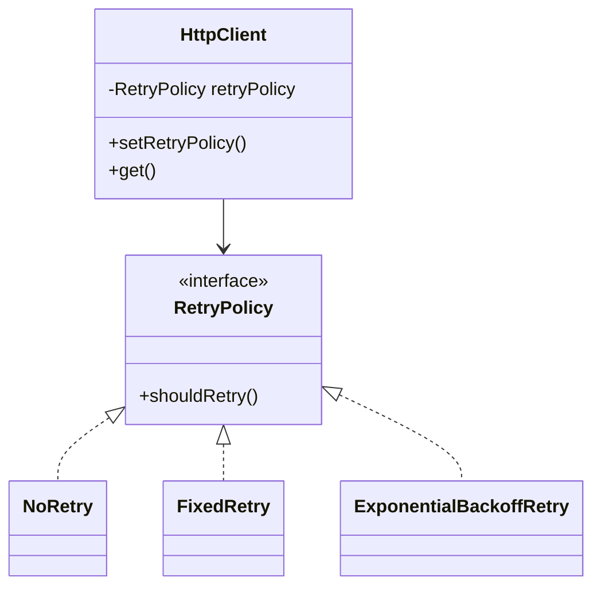
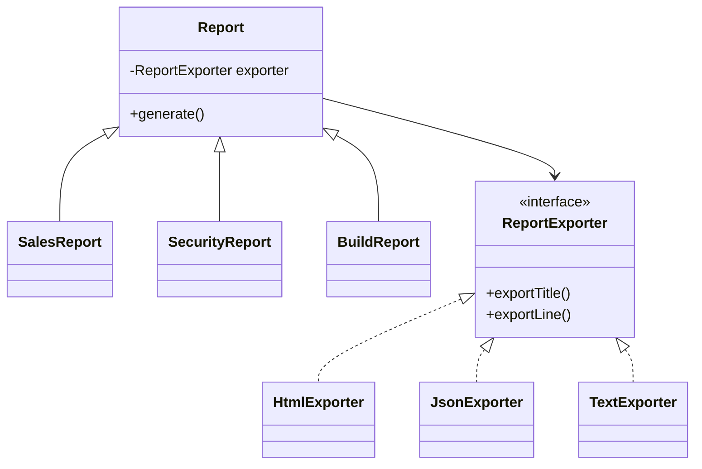

Bridge and Strategy are easy to confuse.

Both patterns often have a class that holds a pointer to an interface.
Both use composition.
Both have multiple concrete implementations behind that interface.

So if you only look at the UML diagram, they can look almost the same.

But they solve different problems.

> **Strategy is about choosing one behavior. Bridge is about separating two things that vary independently.**

That is the main difference.

Let's make this practical with two examples:

* **Strategy:** retry policy
* **Bridge:** report type × export format

---

## Why the confusion happens

A lot of design pattern confusion comes from looking only at structure.

For both Strategy and Bridge, you may see something like this:

```cpp
class SomeClass {
    std::unique_ptr<SomeInterface> impl_;
};
```

That shape alone does not tell you which pattern it is.

The real question is:

> What problem is this design solving?

If the problem is "I need to choose one behavior from many options," it is probably **Strategy**.

If the problem is "I have two independent dimensions and I do not want every combination as a separate class," it is probably **Bridge**.

---

## Strategy example: retry policy

Imagine you are writing a small HTTP client.

Sometimes a request fails.

Different applications may want different retry behavior:

* Do not retry.
* Retry a fixed number of times.
* Retry with exponential backoff.

The HTTP client itself should not hard-code one retry rule.

It should be able to use different retry policies depending on the use case.

This is a good use case for Strategy.

---

## Strategy: define the behavior interface

First, define a retry policy interface:

```cpp
#include <iostream>
#include <memory>
#include <string>

class RetryPolicy {
public:
    virtual ~RetryPolicy() = default;

    virtual bool shouldRetry(int attempt, int statusCode) const = 0;
};
```

Now we can create different retry strategies.

```cpp
class NoRetry : public RetryPolicy {
public:
    bool shouldRetry(int attempt, int statusCode) const override {
        return false;
    }
};

class FixedRetry : public RetryPolicy {
public:
    explicit FixedRetry(int maxAttempts)
        : maxAttempts_(maxAttempts) {}

    bool shouldRetry(int attempt, int statusCode) const override {
        return attempt < maxAttempts_ && statusCode >= 500;
    }

private:
    int maxAttempts_;
};

class ExponentialBackoffRetry : public RetryPolicy {
public:
    explicit ExponentialBackoffRetry(int maxAttempts)
        : maxAttempts_(maxAttempts) {}

    bool shouldRetry(int attempt, int statusCode) const override {
        if (statusCode < 500) {
            return false;
        }

        if (attempt >= maxAttempts_) {
            return false;
        }

        int delayMs = 100 * (1 << attempt);
        std::cout << "Waiting " << delayMs << " ms before retry\n";

        return true;
    }

private:
    int maxAttempts_;
};
```

Each class answers the same question:

> Should this request be retried?

But each one answers it differently.

That is the Strategy pattern.

---

## Strategy: use the policy inside a client

Now the HTTP client can depend on the `RetryPolicy` interface instead of hard-coding retry logic.

```cpp
class HttpClient {
public:
    explicit HttpClient(std::unique_ptr<RetryPolicy> retryPolicy)
        : retryPolicy_(std::move(retryPolicy)) {}

    void setRetryPolicy(std::unique_ptr<RetryPolicy> retryPolicy) {
        retryPolicy_ = std::move(retryPolicy);
    }

    void get(const std::string& url) const {
        int attempt = 0;
        int statusCode = 500;

        while (true) {
            std::cout << "GET " << url << ", attempt " << attempt << "\n";

            // Pretend the request failed with HTTP 500.
            statusCode = 500;

            if (!retryPolicy_->shouldRetry(attempt, statusCode)) {
                break;
            }

            ++attempt;
        }

        std::cout << "Finished request\n";
    }

private:
    std::unique_ptr<RetryPolicy> retryPolicy_;
};
```

The caller chooses the retry strategy:

```cpp
int main() {
    HttpClient client(std::make_unique<FixedRetry>(3));
    client.get("https://example.com/data");

    client.setRetryPolicy(std::make_unique<NoRetry>());
    client.get("https://example.com/status");
}
```

The important part is this:

> The client decides which retry behavior to use.

One thing is varying: the retry algorithm.

That is Strategy.

---

## Bridge example: report type × export format

Now let's look at a different problem.

Imagine you are building a reporting system.

You have different report types:

* Sales report
* Security report
* Build report

And you have different export formats:

* HTML
* JSON
* Plain text

These are two separate dimensions.

```text
Report types × Export formats
```

Without Bridge, you might create classes like this:

```text
SalesHtmlReport
SalesJsonReport
SalesTextReport

SecurityHtmlReport
SecurityJsonReport
SecurityTextReport

BuildHtmlReport
BuildJsonReport
BuildTextReport
```

That is already nine classes.

If you add one new report type, you need to create versions for every export format.
If you add one new export format, you need to create versions for every report type.

This is the class explosion Bridge is meant to avoid.

---

## Bridge: define the implementation side

First, define the export format interface.

This is the implementation side of the Bridge.

```cpp
#include <iostream>
#include <memory>
#include <string>

class ReportExporter {
public:
    virtual ~ReportExporter() = default;

    virtual void exportTitle(const std::string& title) const = 0;
    virtual void exportLine(const std::string& line) const = 0;
};
```

Now create concrete exporters.

```cpp
class HtmlExporter : public ReportExporter {
public:
    void exportTitle(const std::string& title) const override {
        std::cout << "<h1>" << title << "</h1>\n";
    }

    void exportLine(const std::string& line) const override {
        std::cout << "<p>" << line << "</p>\n";
    }
};

class JsonExporter : public ReportExporter {
public:
    void exportTitle(const std::string& title) const override {
        std::cout << "{ \"title\": \"" << title << "\", \"lines\": [\n";
    }

    void exportLine(const std::string& line) const override {
        std::cout << "  \"" << line << "\"\n";
    }
};

class TextExporter : public ReportExporter {
public:
    void exportTitle(const std::string& title) const override {
        std::cout << "== " << title << " ==\n";
    }

    void exportLine(const std::string& line) const override {
        std::cout << "- " << line << "\n";
    }
};
```

These classes know how to export content.

They do not know what kind of report they are exporting.

---

## Bridge: define the abstraction side

Now define the report hierarchy.

Each report has a `ReportExporter`.

```cpp
class Report {
public:
    explicit Report(std::unique_ptr<ReportExporter> exporter)
        : exporter_(std::move(exporter)) {}

    virtual ~Report() = default;

    virtual void generate() const = 0;

protected:
    std::unique_ptr<ReportExporter> exporter_;
};
```

Now we can create different report types.

```cpp
class SalesReport : public Report {
public:
    using Report::Report;

    void generate() const override {
        exporter_->exportTitle("Sales Report");
        exporter_->exportLine("Revenue: $1,000,000");
        exporter_->exportLine("Top region: APAC");
    }
};

class SecurityReport : public Report {
public:
    using Report::Report;

    void generate() const override {
        exporter_->exportTitle("Security Report");
        exporter_->exportLine("Open vulnerabilities: 3");
        exporter_->exportLine("Critical incidents: 0");
    }
};

class BuildReport : public Report {
public:
    using Report::Report;

    void generate() const override {
        exporter_->exportTitle("Build Report");
        exporter_->exportLine("Build status: Passed");
        exporter_->exportLine("Tests run: 248");
    }
};
```

Usage:

```cpp
int main() {
    SalesReport sales(std::make_unique<HtmlExporter>());
    sales.generate();

    SecurityReport security(std::make_unique<TextExporter>());
    security.generate();

    BuildReport build(std::make_unique<JsonExporter>());
    build.generate();
}
```

Now report types and export formats can vary independently.

You can add a new report type without changing the exporters.
You can add a new exporter without changing the reports.

That is Bridge.

---

## Why this is not Strategy

At this point, you might ask:

> The report also holds a pointer to an exporter. Why is this not Strategy?

The difference is the intent.

In the retry example, the whole point was to choose one behavior:

```text
No retry
Fixed retry
Exponential backoff retry
```

The HTTP client asks: *Which retry algorithm should I use?* That is Strategy.

In the report example, the goal is not just to swap one algorithm. The goal is to separate two independent hierarchies:

```text
Sales report      HTML exporter
Security report   JSON exporter
Build report      Text exporter
```

Reports and exporters can grow separately. That is Bridge.

---

## The practical difference

| Question | Strategy | Bridge |
|---|---|---|
| Main idea | Choose one behavior | Separate two independent dimensions |
| Example | Retry policy | Report type × export format |
| What varies? | Retry algorithm | Report type and export format |
| Common problem | Avoid hard-coded behavior | Avoid class explosion |
| Client role | Usually chooses the behavior | Works with an abstraction connected to an implementation |
| Mental model | "Use this behavior" | "Connect these two dimensions" |

---

## A simple rule

Use **Strategy** when the sentence sounds like this:

> Use this algorithm to do the task.

Examples: use fixed retry, use LRU cache eviction, use price-based sorting.

Use **Bridge** when the sentence sounds like this:

> Combine this abstraction with that implementation, without creating a class for every combination.

Examples: sales report exported as HTML, circle rendered using Vulkan, dialog rendered on Linux.

---

## Litmus test

1. Is only one thing varying? → may be Strategy.
2. Are two independent dimensions varying? → may be Bridge.
3. Would a naive design create many combination classes? → Bridge is likely the better fit.
4. Is the caller mainly choosing a behavior? → Strategy is likely the better fit.

---

## Diagrams

### Strategy — retry policy



One dimension varies. The client picks the algorithm.

### Bridge — report × export format



Two dimensions vary independently. Adding a new report type or a new exporter does not require touching the other side.

---

## C++ notes

The examples use `std::unique_ptr` to make ownership explicit — no raw `new`, no manual `delete`.

Every polymorphic base has a virtual destructor. Skipping this when deleting through a base pointer is undefined behavior.

Every override is marked `override`. This lets the compiler catch signature mismatches.

One more practical note: if your Strategy choices are fixed at compile time, `std::variant` and `std::visit` can replace a virtual interface and avoid runtime dispatch entirely.

---

## Final takeaway

Bridge and Strategy can look similar in code. Both may use composition. Both may hold a pointer to an interface.

But the intent is different.

**Strategy** is about choosing a behavior.

**Bridge** is about separating two independent dimensions so they can grow without creating a class for every combination.

Do not identify the pattern only by the diagram. Ask what problem the design is solving.
